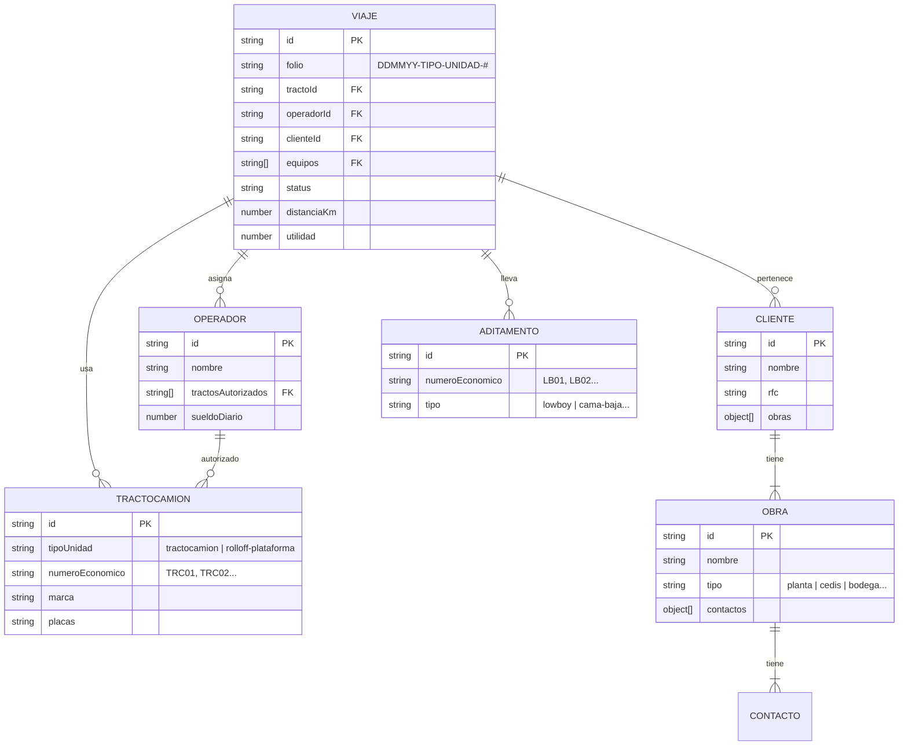
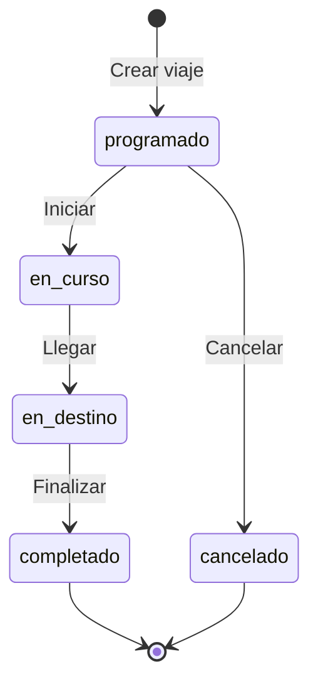
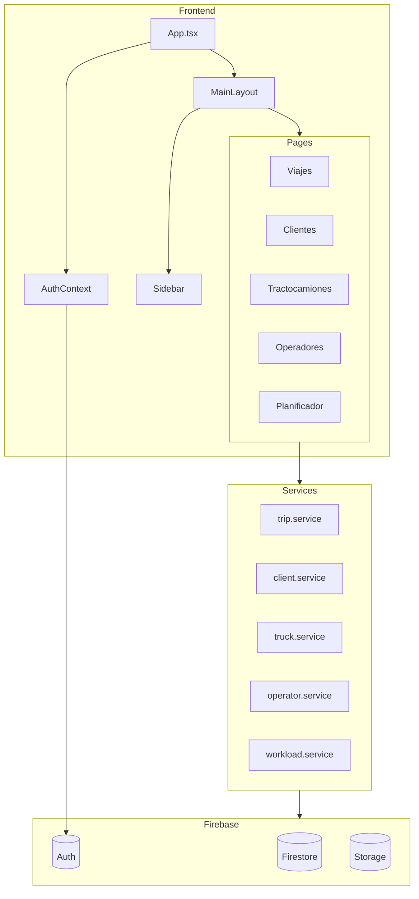
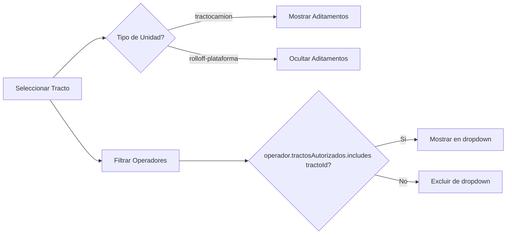

# RMB Transportes - Documentacion Completa para Claude

## Descripcion del Proyecto

Sistema de gestion integral para **RMB Transportes**, empresa de transporte de carga pesada especializada en:
- Tractocamiones con lowboys para maquinaria pesada
- Unidades roll-off con plataforma para contenedores
- Servicios de entrega, recoleccion, cambios y fletes

**Stack Tecnologico:**
- Frontend: React 19 + TypeScript 5.9 + Vite 7
- Backend: Firebase (Firestore, Auth, Storage)
- UI: Tailwind CSS 4 + Lucide Icons
- Mapas: Mapbox GL
- Estado: Zustand + React Query
- Formularios: React Hook Form + Zod

---

## Arquitectura del Proyecto

```
src/
├── components/           # Componentes reutilizables
│   ├── admin/           # Componentes administrativos (reportes, modales)
│   ├── common/          # Componentes comunes (FileUploader)
│   ├── forms/           # Formularios (ClienteForm)
│   ├── layout/          # Layout principal (MainLayout, Sidebar)
│   ├── maps/            # Componentes de mapas (MapView, AddressSearch)
│   └── planificador/    # Componentes del planificador (WorkloadBar, CriticalPath)
│
├── context/             # Contextos React
│   └── AuthContext.tsx  # Autenticacion Firebase
│
├── data/                # Datos estaticos
│   └── codigosPostales/ # JSON con CPs de todos los estados de Mexico
│
├── hooks/               # Custom hooks (pendiente)
│
├── pages/               # Paginas/Modulos principales (22 modulos)
│   ├── Aditamentos/     # Catalogo de lowboys, plataformas
│   ├── Casetas/         # Registro de cruces de casetas
│   ├── Clientes/        # Gestion de clientes y obras
│   ├── Combustible/     # Control de cargas de combustible
│   ├── Dashboard/       # Panel principal con metricas
│   ├── Estaciones/      # Catalogo de gasolineras
│   ├── Finanzas/        # Costos, gastos, comprobantes
│   ├── Flota/           # Vista general de flota (pendiente)
│   ├── Importador/      # Importacion masiva de datos
│   ├── Inventario/      # EPP y herramientas
│   ├── Landing/         # Pagina publica
│   ├── Legal/           # Documentos legales
│   ├── Login/           # Autenticacion
│   ├── Maniobristas/    # Catalogo de ayudantes
│   ├── Mantenimiento/   # Control de mantenimiento
│   ├── Operadores/      # Catalogo de choferes
│   ├── Planificador/    # Optimizacion de carga de trabajo
│   ├── Rutas/           # Gestion de rutas (pendiente)
│   ├── Telemetria/      # Datos GPS de Mastrack
│   ├── Tractocamiones/  # Catalogo de unidades
│   ├── Usuarios/        # Gestion de usuarios del sistema
│   └── Viajes/          # Ordenes de trabajo (modulo principal)
│
├── scripts/             # Scripts de utilidades
│   ├── seedClientes.ts  # Generar clientes de prueba
│   ├── seedViajes.ts    # Generar viajes de prueba
│   └── fetchCodigosPostales.ts # Descargar CPs de SEPOMEX
│
├── services/            # Logica de negocio y Firebase
│   ├── firebase.ts      # Configuracion Firebase
│   ├── client.service.ts
│   ├── trip.service.ts
│   ├── truck.service.ts
│   ├── operator.service.ts
│   ├── attachment.service.ts
│   ├── fuel.service.ts
│   ├── toll.service.ts
│   ├── inventory.service.ts
│   ├── maniobrista.service.ts
│   ├── fuelstation.service.ts
│   ├── telemetry.service.ts
│   ├── workload.service.ts
│   ├── mapbox.service.ts
│   ├── storage.service.ts
│   ├── currency.service.ts
│   ├── export.service.ts
│   ├── staff.service.ts
│   └── codigopostal.service.ts
│
├── store/               # Stores de Zustand
│   └── authStore.ts     # Estado de autenticacion
│
├── types/               # Tipos TypeScript
│   ├── trip.types.ts    # Viajes
│   ├── client.types.ts  # Clientes y Obras
│   ├── truck.types.ts   # Tractocamiones
│   ├── operator.types.ts # Operadores
│   ├── attachment.types.ts # Aditamentos
│   ├── fuel.types.ts    # Combustible
│   ├── toll.types.ts    # Casetas
│   ├── inventory.types.ts # Inventario
│   ├── maniobrista.types.ts # Maniobristas
│   ├── fuelstation.types.ts # Estaciones
│   ├── telemetry.types.ts # Telemetria GPS
│   ├── workload.types.ts # Carga de trabajo
│   ├── route.types.ts   # Rutas
│   ├── cost.types.ts    # Costos
│   └── staff.types.ts   # Personal administrativo
│
├── utils/               # Utilidades
│   └── cn.ts            # Tailwind class merger
│
├── App.tsx              # Rutas de la aplicacion
└── main.tsx             # Punto de entrada
```

---

## Conceptos Clave: OS vs OT

| Concepto | Modulo | Prefijo Folio | Descripcion |
|----------|--------|---------------|-------------|
| **Orden de Servicio (OS)** | Viajes | `OS-` | Servicio de transporte para un cliente externo |
| **Orden de Trabajo (OT)** | Mantenimiento | `OT-` | Trabajo interno en una unidad (reparacion, servicio) |

### Relacion OS → OT
Una Orden de Trabajo puede originarse de una Orden de Servicio:
- Operador reporta falla durante un viaje → Se genera OT de mantenimiento
- Campo `ordenServicioOrigen` en OT vincula al viaje que la genero

```typescript
// Ejemplo de OT originada de OS
interface OrdenTrabajo {
  folio: string;                    // OT-171225-TRC02-1
  ordenServicioOrigen?: string;     // OS-171225-EN-TRC02-1 (opcional)
  // ... resto de campos
}
```

---

## Modulos Principales

### 1. Viajes (Ordenes de Servicio)
**Archivo:** `src/pages/Viajes/index.tsx`
**Servicio:** `src/services/trip.service.ts`
**Tipos:** `src/types/trip.types.ts`

El modulo central del sistema. Cada viaje representa una orden de trabajo con:

**Estructura de un Viaje:**
```typescript
interface Viaje {
  id: string;
  folio: string;              // DDMMYY-TIPO-UNIDAD-# (ej: 171225-EN-TRC02-1)
  fecha: Date;
  fechaCompromiso?: Date;

  // Asignaciones
  tractoId: string;           // ID del tractocamion
  operadorId: string;         // ID del operador
  maniobristaId?: string;     // ID del maniobrista (opcional)
  equipos: string[];          // IDs de aditamentos (lowboys, etc.)

  // Cliente y destino
  clienteId: string;
  clienteNombre: string;      // Denormalizado
  destino: DestinoViaje;

  // Tipo de servicio
  tipoServicio: 'Entrega' | 'Recoleccion' | 'Cambio' | 'Flete en falso' |
                'Movimiento' | 'Regreso' | 'Entrega / Recoleccion';

  // Metricas
  distanciaKm: number;
  costos: CostosViaje;        // sueldos, casetas, combustible, etc.
  ingresos: IngresosViaje;    // flete, recargos
  utilidad: number;
  margenUtilidad: number;     // Porcentaje

  // Status
  status: 'programado' | 'en_curso' | 'en_destino' | 'completado' | 'cancelado';

  // Tiempos
  tiempos: {
    inicio?: Date;
    llegada?: Date;
    tiempoEspera?: number;    // minutos
    partida?: Date;
    fin?: Date;
    duracionTotal?: number;   // minutos
  };
}
```

**Generacion de Folio (Orden de Servicio):**
```
OS-DDMMYY-TIPO-UNIDAD-SECUENCIA
Ejemplo: OS-171225-EN-TRC02-1

Prefijo:
- OS = Orden de Servicio (Viajes/Transporte)
- OT = Orden de Trabajo (Mantenimiento) - ver seccion Mantenimiento

Tipos de Servicio:
- EN = Entrega
- RE = Recoleccion
- CA = Cambio
- FF = Flete en falso
- MO = Movimiento
- RG = Regreso
- ER = Entrega/Recoleccion
```

### 2. Clientes y Obras
**Archivo:** `src/pages/Clientes/index.tsx`
**Servicio:** `src/services/client.service.ts`
**Tipos:** `src/types/client.types.ts`

Cada cliente puede tener multiples obras/sucursales:

```typescript
interface Cliente {
  id: string;
  nombre: string;             // Razon social
  nombreComercial?: string;
  rfc?: string;

  direccion: DireccionCliente; // Oficinas centrales
  obras: ObraCliente[];        // Multiples ubicaciones

  estadisticas: {
    totalViajes: number;
    ingresoTotal: number;
    calificacionPago: 'excelente' | 'bueno' | 'regular' | 'malo';
  };
}

interface ObraCliente {
  id: string;
  nombre: string;             // "Planta Monterrey", "CEDIS Guadalajara"
  tipo: 'planta' | 'cedis' | 'bodega' | 'obra' | 'oficina' | 'sucursal' | 'otro';
  direccion: DireccionCliente;
  contactos: ContactoObra[];   // IMPORTANTE: Es un array, no un objeto
  condicionesAcceso?: CondicionesAccesoObra;
}
```

### 3. Tractocamiones
**Archivo:** `src/pages/Tractocamiones/index.tsx`
**Servicio:** `src/services/truck.service.ts`
**Tipos:** `src/types/truck.types.ts`

Dos tipos de unidades:

```typescript
type TipoUnidad = 'tractocamion' | 'rolloff-plataforma';

interface Tractocamion {
  id: string;
  tipoUnidad: TipoUnidad;
  numeroEconomico: string;    // TRC01, TRC02, etc.
  marca: string;
  modelo: string;
  placas: string;
  numSerie: string;           // VIN
  rendimientoPromedio?: number; // km/litro
  odometroActual?: number;
  gpsId?: string;             // ID de Mastrack
  tagId?: string;             // Numero de TAG para casetas
}
```

### 4. Operadores
**Archivo:** `src/pages/Operadores/index.tsx`
**Servicio:** `src/services/operator.service.ts`
**Tipos:** `src/types/operator.types.ts`

```typescript
interface Operador {
  id: string;
  nombre: string;
  telefono: string;
  licencia: {
    numero: string;
    tipo: 'federal' | 'estatal';
    vigencia: Date;
  };
  sueldoDiario: number;
  tractosAutorizados: string[];  // IDs de tractos que puede operar
  fechaIngreso: Date;
}
```

### 5. Aditamentos
**Archivo:** `src/pages/Aditamentos/index.tsx`
**Servicio:** `src/services/attachment.service.ts`
**Tipos:** `src/types/attachment.types.ts`

```typescript
type TipoAditamento = 'lowboy' | 'plataforma-rolloff' | 'cama-baja' | 'otro';

interface Aditamento {
  id: string;
  numeroEconomico: string;    // LB01, LB02, etc.
  tipo: TipoAditamento;
  marca?: string;
  capacidadCarga?: number;    // Toneladas
}
```

### 6. Planificador
**Archivo:** `src/pages/Planificador/index.tsx`
**Servicio:** `src/services/workload.service.ts`
**Tipos:** `src/types/workload.types.ts`

Optimiza la carga de trabajo por unidad:

```typescript
const WORKLOAD_CONFIG = {
  TARGET_KM_PER_DAY: 600,     // Objetivo km/dia
  OVERLOAD_THRESHOLD: 100,    // % sobrecarga
  UNDERLOAD_THRESHOLD: 50,    // % subutilizacion
  AVG_SPEED_KMH: 60,
  SERVICE_TIME_MIN: 30,       // Tiempo en destino
};

// Base de operaciones (Tecamac)
const ORIGEN_BASE_RMB = { lat: 19.7129, lng: -98.9688 };
```

---

## Reglas de Negocio Criticas

### 1. Operadores ↔ Tractocamiones
**Cada operador tiene un array `tractosAutorizados[]` que define que unidades puede operar.**

```typescript
// Verificar si operador puede usar un tracto:
const puedeOperar = operador.tractosAutorizados.includes(tractoId);
```

En la UI de Viajes, al seleccionar un tracto, el dropdown de operadores se filtra automaticamente.

### 2. Aditamentos segun Tipo de Unidad
**Solo las unidades tipo `tractocamion` pueden llevar aditamentos (lowboys, camas bajas).**
**Las unidades `rolloff-plataforma` NO pueden llevar aditamentos.**

```typescript
// En el formulario de viajes:
const puedeUsarAditamentos = tracto.tipoUnidad === 'tractocamion';

// Si es rolloff, el campo equipos[] debe estar vacio o no mostrarse
```

### 3. Tipos de Obra Validos
Solo estos valores son aceptados:
```typescript
type TipoObra = 'planta' | 'cedis' | 'bodega' | 'obra' | 'oficina' | 'sucursal' | 'otro';
```

### 4. Contactos en Obras
**Es un array `contactos[]`, NO un objeto `contacto`.**

```typescript
// CORRECTO:
obra.contactos = [
  { id: '1', nombre: 'Juan', telefono: '555-1234', esPrincipal: true },
  { id: '2', nombre: 'Maria', telefono: '555-5678', esPrincipal: false }
];

// INCORRECTO:
obra.contacto = { nombre: 'Juan', telefono: '555-1234' }; // NO USAR
```

### 5. Status de Viajes
El flujo de estados es:
```
programado → en_curso → en_destino → completado
     ↓
 cancelado
```

- Solo se pueden editar viajes en status `programado`
- Al iniciar viaje, se valida que tenga tracto, operador y cliente

### 6. Calculo de Costos
```typescript
costos.total = costos.sueldos + costos.seguros + costos.casetas +
               costos.combustible + costos.comidas + costos.transporte + costos.otros;

utilidad = ingresos.total - costos.total;
margenUtilidad = (utilidad / ingresos.total) * 100;
```

### 7. Firebase - Valores Undefined
**Firebase Firestore NO acepta valores `undefined`. Usar `null` en su lugar.**

```typescript
// CORRECTO:
const data = {
  nombre: 'Juan',
  notas: notas || null,
  foto: foto || null,
};

// INCORRECTO - causara error:
const data = {
  nombre: 'Juan',
  notas: undefined,  // ERROR
};
```

---

## Catalogo Actual (Diciembre 2025)

### Tractocamiones
| Numero | Tipo | Operador Autorizado | Puede usar Aditamentos |
|--------|------|---------------------|------------------------|
| TRC02 | tractocamion | Manuel Perea Rodriguez | Si (LB02) |
| TRC07 | tractocamion | SIN OPERADOR | Si |
| TRC08 | tractocamion | SIN OPERADOR | Si |
| TRC09 | tractocamion | SIN OPERADOR | Si |
| TRC10 | rolloff-plataforma | Luis Rojas Lopez | NO |
| TRC11 | rolloff-plataforma | Celso Nestor Manrique Gomez | NO |

### Aditamentos
| Numero | Tipo | Marca |
|--------|------|-------|
| LB02 | lowboy | Aztec |

### Operadores Activos
| Nombre | Tractos Autorizados |
|--------|---------------------|
| Manuel Perea Rodriguez | TRC02 |
| Luis Rojas Lopez | TRC10 |
| Celso Nestor Manrique Gomez | TRC11 |

---

## Servicios Firebase

### Colecciones en Firestore
```
firestore/
├── viajes/           # Ordenes de trabajo
├── clientes/         # Clientes con obras embebidas
├── tractocamiones/   # Catalogo de unidades
├── operadores/       # Catalogo de choferes
├── aditamentos/      # Catalogo de lowboys, etc.
├── maniobristas/     # Catalogo de ayudantes
├── usuarios/         # Usuarios del sistema
├── casetas/          # Cruces de casetas
├── combustible/      # Cargas de combustible
├── inventario/       # EPP y herramientas
├── estaciones/       # Gasolineras
└── telemetria/       # Datos GPS
```

### Configuracion Firebase
```typescript
// src/services/firebase.ts
const firebaseConfig = {
  apiKey: import.meta.env.VITE_FIREBASE_API_KEY,
  authDomain: import.meta.env.VITE_FIREBASE_AUTH_DOMAIN,
  projectId: import.meta.env.VITE_FIREBASE_PROJECT_ID,
  storageBucket: import.meta.env.VITE_FIREBASE_STORAGE_BUCKET,
  messagingSenderId: import.meta.env.VITE_FIREBASE_MESSAGING_SENDER_ID,
  appId: import.meta.env.VITE_FIREBASE_APP_ID,
};
```

**Proyecto:** rmbtransportes-d8c6f
**Storage:** rmbtransportes-d8c6f.firebasestorage.app
**CORS:** Configurado para localhost:5173 y localhost:5174

---

## Codigos Postales de Mexico

El sistema tiene datos locales de codigos postales para todos los estados:
- Ubicacion: `src/data/codigosPostales/*.json`
- Servicio: `src/services/codigopostal.service.ts`
- Funcion: `consultarCodigoPostal(cp)` - busca local primero, luego API externa

Estados con datos locales:
- Todos los 32 estados de Mexico
- Fuente: SEPOMEX via script fetchCodigosPostales.ts

---

## Rutas de la Aplicacion

```typescript
// Rutas publicas
/           → Landing page
/login      → Login (redirige a /panel si autenticado)

// Rutas protegidas (requieren autenticacion)
/panel          → Dashboard
/viajes         → Ordenes de trabajo
/planificador   → Optimizacion de carga
/rutas          → Gestion de rutas

// Catalogos de Flota
/tractocamiones → Unidades
/aditamentos    → Lowboys, plataformas

// Catalogos de Personal
/operadores     → Choferes
/maniobristas   → Ayudantes

// Catalogos Generales
/clientes       → Empresas y obras
/inventario     → EPP y herramientas
/estaciones     → Gasolineras

// Operaciones
/combustible    → Control de cargas
/casetas        → Cruces de casetas
/telemetria     → GPS Mastrack
/finanzas       → Costos y gastos
/mantenimiento  → Control de mantenimiento

// Sistema
/legal          → Documentos legales
/usuarios       → Gestion de usuarios
/importador     → Importacion masiva
```

---

## Dependencias Principales

```json
{
  "react": "^19.2.0",
  "typescript": "~5.9.3",
  "vite": "^7.2.4",
  "firebase": "^12.6.0",
  "tailwindcss": "^4.1.18",
  "react-router-dom": "^7.10.1",
  "zustand": "^5.0.9",
  "@tanstack/react-query": "^5.90.12",
  "react-hook-form": "^7.68.0",
  "zod": "^4.2.0",
  "mapbox-gl": "^3.17.0",
  "lucide-react": "^0.561.0",
  "recharts": "^3.6.0",
  "xlsx": "^0.18.5",
  "@react-pdf/renderer": "^4.3.1"
}
```

---

## Comandos Utiles

```bash
# Desarrollo
npm run dev              # Inicia servidor en localhost:5173
npm run dev -- --host    # Expone en red local

# Build
npm run build            # Compila para produccion
npm run preview          # Preview del build

# Tipos
npx tsc --noEmit         # Verificar tipos sin compilar

# Scripts de seed
npx tsx src/scripts/seedClientes.ts   # Crear clientes de prueba
npx tsx src/scripts/seedViajes.ts     # Crear viajes de prueba

# GitHub CLI
gh issue list            # Ver issues
gh issue create          # Crear issue
gh pr create             # Crear PR
```

---

## Convenciones de Codigo

### Nombres de Archivos
- Servicios: `*.service.ts` en `src/services/`
- Tipos: `*.types.ts` en `src/types/`
- Paginas: `index.tsx` en `src/pages/NombreModulo/`
- Componentes: `PascalCase.tsx` en `src/components/`

### Patrones Comunes

**Obtener datos:**
```typescript
const items = await obtenerItems(filtros);
const item = await obtenerItem(id);
```

**Crear/Actualizar:**
```typescript
const nuevo = await crearItem(input);
await actualizarItem(id, cambios);
```

**Soft delete:**
```typescript
await desactivarItem(id);  // activo = false
await reactivarItem(id);   // activo = true
```

**Para selects:**
```typescript
const opciones = await obtenerItemsSelect();
// Retorna: { id, label, ...camposExtra }[]
```

---

## Archivos de Gestion

| Archivo | Proposito |
|---------|-----------|
| `CLAUDE.md` | Este archivo - contexto completo para Claude |
| `TODO.md` | Pendientes, bugs, checklist de QA |
| `NOTES.md` | Notas de desarrollo por sesion |
| `.claude/settings.local.json` | Configuracion local de Claude Code |

---

## GitHub Project

**Tablero Kanban:** https://github.com/users/VicenteCB07/projects/1

### Issues Activos
- **#1:** Asignar operadores a TRC07, TRC08, TRC09
- **#2:** Agregar mas aditamentos al catalogo

---

## Notas Importantes para Claude

1. **Siempre leer el codigo antes de modificar** - No asumir estructuras
2. **Respetar las reglas de negocio** - Especialmente operador-tracto y rolloff sin aditamentos
3. **Usar `null` en lugar de `undefined`** para Firebase
4. **Los contactos de obras son un array** - No un objeto
5. **Scripts de seed no pueden usar import.meta.env** - Es exclusivo de Vite
6. **Probar como usuario** - Verificar que los cambios funcionen en la UI

---

## Instrucciones de Comportamiento

1. **Pregunta antes de asumir** - Si hay ambigüedad, pregunta antes de implementar
2. **Mantén orden estructurado** - Usa TodoWrite para tareas complejas
3. **Lee antes de modificar** - Siempre leer el código existente primero
4. **Valida con el usuario** - Confirma cambios importantes antes de ejecutar
5. **Rol dual** - Puedo actuar como programador Y como usuario para testing
6. **Sin emojis** - A menos que se soliciten explícitamente
7. **Respuestas concisas** - Directo al punto, sin relleno
8. **Autonomia total** - Operar desde terminal/VSCode, ejecutar todos los comandos necesarios, hacer configuraciones sin pedir al usuario que las haga manualmente

---

## Herramientas de Desarrollo

### 1. Madge - Analisis de Dependencias
Instalado para detectar dependencias circulares y generar grafos visuales.

```bash
# Verificar dependencias circulares
npx madge --circular src/App.tsx

# Generar grafo visual (requiere graphviz)
npx madge --image docs/dependency-graph.svg src/App.tsx

# Ver dependencias de un archivo
npx madge src/services/trip.service.ts
```

**Grafo actual:** `docs/dependency-graph.svg`

### 2. Mermaid - Diagramas en Markdown
GitHub renderiza diagramas Mermaid automaticamente. Usar para documentar arquitectura y flujos.

### 3. GitHub Projects
Tablero Kanban para gestionar tareas. Requiere autenticar con:
```bash
gh auth refresh -h github.com -s project,read:project
```

---

## Diagramas de Arquitectura

### Modelo de Datos (ERD)



### Flujo de Estados - Viaje



### Arquitectura de Componentes



### Regla de Negocio: Operador-Tracto



---

*Ultima actualizacion: 17 Diciembre 2025*
